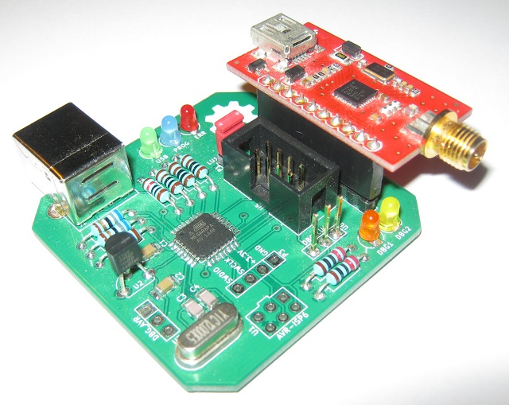
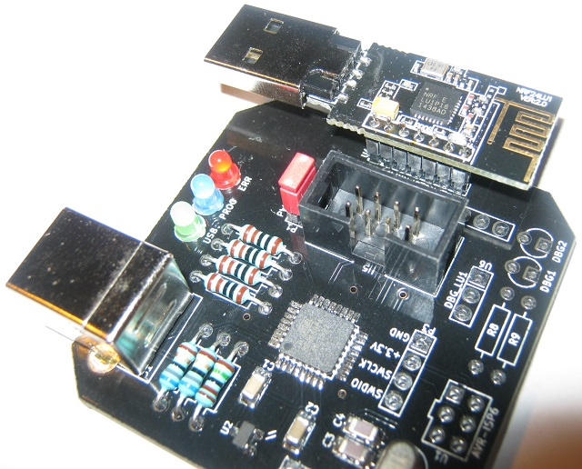

# nrfburn
This is a hardware and software package for flashing Nordic Semiconductors nRF24LE1 and nRF24LU1+ microcontrollers. It consists of three parts: the flasher device with a USB connection, the firmware running on the flasher, and a host program which sends command to the flasher over the USB connection.

### The flasher

The flasher is based around an Atmel AVR ATmega88pa microcontroller running at 12MHz and 3.3V. The PCB is a mixture of through-hole and SMD components chosen as a compromise between size, ease of hand-soldering and mechanical robustness.

It has connectors with pin configurations which allow two popular nRF24LU1+ breakouts and dongles to be directly plugged into the flasher. One is the SparkFun Tranciever Breakout - nRF24LU1+, and the other is the popular nRF USB dongle from ebay.

It also has an 8 pin flat cable connector through which it can flash nRF24LE1 devices as an in-system programmer.

The DBG_LU1 output can be used as a UART debug output from the nRF24LU1+ dongle. There are also two LEDs (DBG1 and DBG2) which can be driven from the SparkFun breakout. This is also useful for debugging.

### The firmware

The flasher firmware communicates with the host PC though [obdev's V-USB](https://www.obdev.at/products/vusb/index.html). It accepts commands from the PC, executes them and sends responses.

### The host PC

The program running on the host PC is a cross-platform (Windows and Linux) command line tool. It does not need special OS drivers because all communication is done through the USB HID class. It's been tested on Windows 7, 8 and 10 and on Linux running on Hardkernel's Odroid X2 board.
