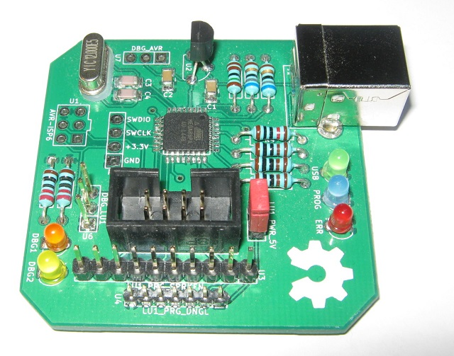

# nrfburn
This is a hardware and software package for flashing Nordic Semiconductors nRF24LE1 and nRF24LU1+ microcontrollers. It consists of three parts: the flasher device with a USB connection, the firmware running on the flasher, and a host program which sends command to the flasher over the USB connection.

### The flasher

The flasher is based around an Atmel AVR ATmega88pa microcontroller running at 12MHz. The PCB is a mixture of through-hole and SMD components chosen as a compromise between size, ease of hand-soldering and mechanical robustness.

It has connectors with pin configurations which allow two popular USB dongles to be directly plugged into the flasher. One is the SparkFun SparkFun Tranciever Breakout - nRF24LU1+, and the other is the popular nRF USB dongle from ebay.

